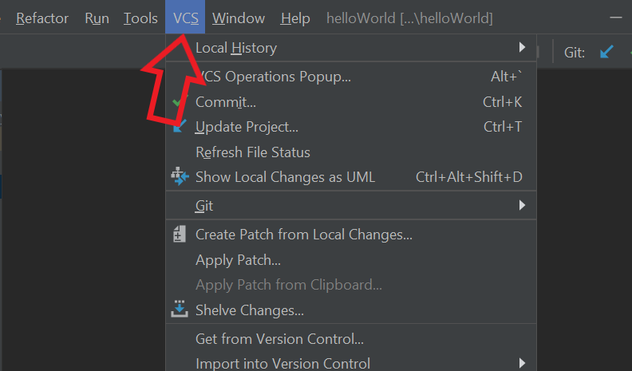
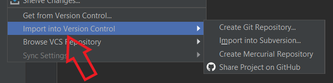
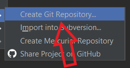
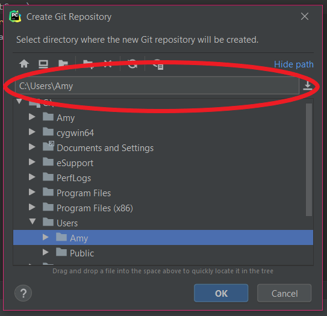
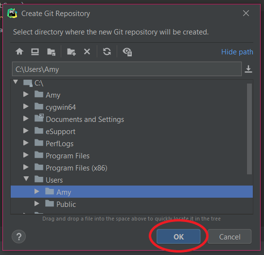
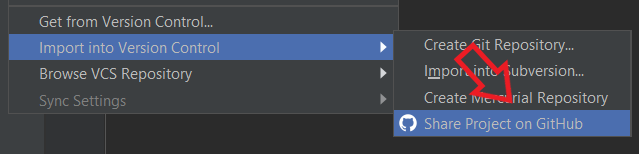
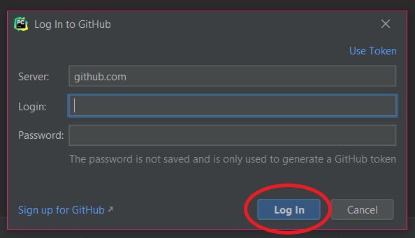
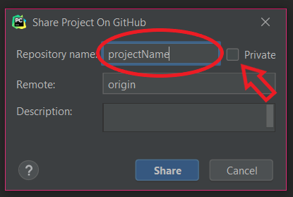
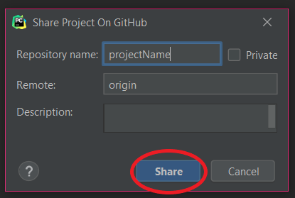

---	
layout: default	
title: Creating a Git Repository And Connecting To Github
nav_order: 2	
---	

# Creating a Git Repository And Connecting To Github
{: .no_toc }	


Create a git repository and connect it to Github to version control and share your code
{: .fs-6 .fw-300 }	
## Table of contents	
{: .no_toc .text-delta }	
1. TOC	
{:toc}	

***

## Create a local git repository
_Version control_ allows the programmer to view their progress and easily revert to the previous version when required. In order to enable version control, you first need to create a local Git repository.

By using PyCharm's _Git_ integeration, you can create a local _git repository_ with the easy-to-understand _GUI_.

1. Click ```VCS``` on the menu bar
> 

2. Click ```Import into Version Control```
> 

3. Click ```Create Git Repository```
> 

4. Choose a destination folder for your Git repository
> 

5. Click ```Ok``` at the bottom
> 

***

## Connecting to GitHub
Once you finished setting up the local Git repository, you can control the versions and share the repository with others using GitHub.

PyCharm's Git integration removes the need to understand git command used on command line interface (Command Prompt for Window) making it ideal for someone learning the basics of Git and GitHub.

1. Click ```VCS```
> 

2. Click ```Import into Version Control```
> 

3. Click ```Share Project on GitHub```
> 

4. Log in using GitHub ID and password
> 

5. Set repository name and privacy level
> 

6. Click ```Share```
> 

---

You have created a local Git repository on your personal computer and connected it to your GitHub account.
