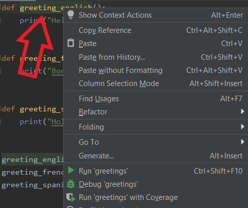

# Creating a Unit Test File
{: .no_toc }

This section will guide you through the steps to create a unit test file in PyCharm using two methods: using the toolbar at the top and right-clicking the function.
{: .fs-6 .fw-300 }

## Table of contents	
{: .no_toc .text-delta }	
1. TOC	
{:toc}

---

## Method 1: Using the Toolbar
1. Click or highlight the name of the function
> 

2. Click ```Code``` from the toolbar at the top
> 

3. Click ```Generate...```
> 

4. Click ```Test```
> 

5. Click the checkbox for all functions that require unit tests
> 

6. Click ```Ok```
> 

7. Add file to Git repository if prompted
> 

## Method 2: Right-Clicking the Function
1. Right click the name of the function
> 

2. Click ```Generate…```
> 

3. Click ```Test```
> 

4. Click the checkbox for all functions that require unit tests
> 

5. Click ```Ok```
> 

6. Add file to Git repository if prompted
> 

***

You have created a unit test file.
