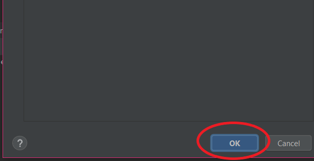

# Creating a Unit Test File
{: .no_toc }

Create a unit test file for a function.
{: .fs-6 .fw-300 }

## Table of contents	
{: .no_toc .text-delta }	
1. TOC	
{:toc}

---

## Creating a Unit Test File
This section will guide you through the steps to create a unit test file in PyCharm using two methods: using the toolbar at the top and right-clicking the function.

---

## Method 1: Using the Toolbar
1. Click or highlight the name of the function
> 

❗ **Note:** You _must_ do this step or else the option to generate a unit test will _not appear_.

2. Click ```Code``` from the toolbar at the top
> 

3. Click ```Generate...```
> 

4. Click ```Test```
> 

5. Click the checkbox for all functions that require unit tests
> 

❗ **Note:** You must check the checkbox next to the function or else a unit test will not be created.

6. Click ```Ok```
> 

7. Add file to Git repository if prompted
> 

❗ **Note:** See [Adding, Committing and Pushing your code to Github](https://dlee.ca/user-documentation/docs/task3/) for manually adding the file to your git repository.

---

## Method 2: Right-Clicking the Function
1. Right click the name of the function
> 

2. Click ```Generate…```
> 

3. Click ```Test```
> 

4. Click the checkbox for all functions that require unit tests
> 

❗ **Note:** You must check the checkbox next to the function or else a unit test will not be created.

5. Click ```Ok```
> 

6. Add file to Git repository if prompted
> 

❗ **Note:** See [Adding, Committing and Pushing your code to Github](https://dlee.ca/user-documentation/docs/task3/) for manually adding the file to your git repository.

---

By the end of these instructions, you will now have a unit test file created for your function. You can now write your suite of unit tests inside this file.
