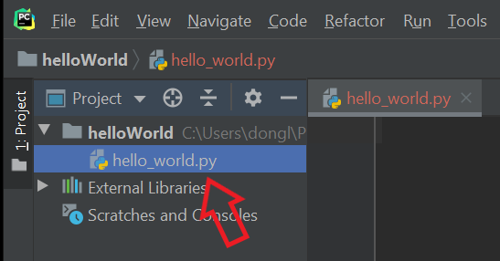
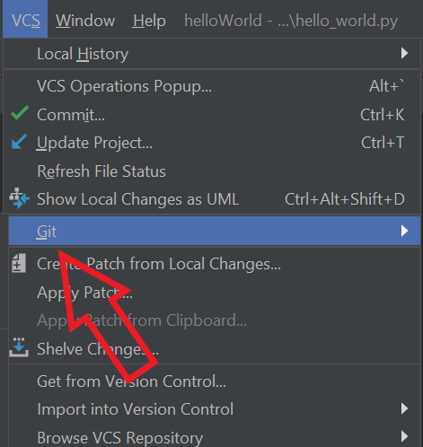
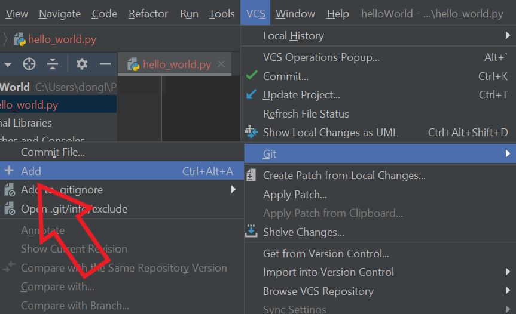
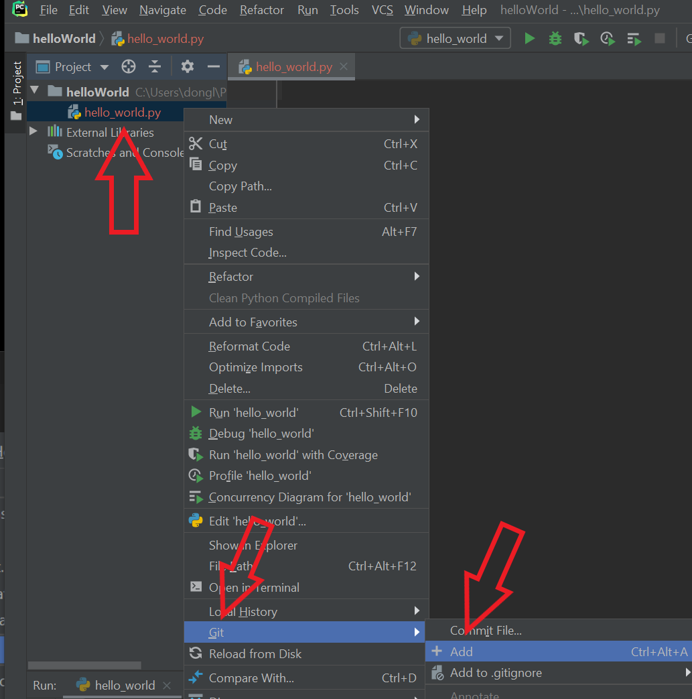
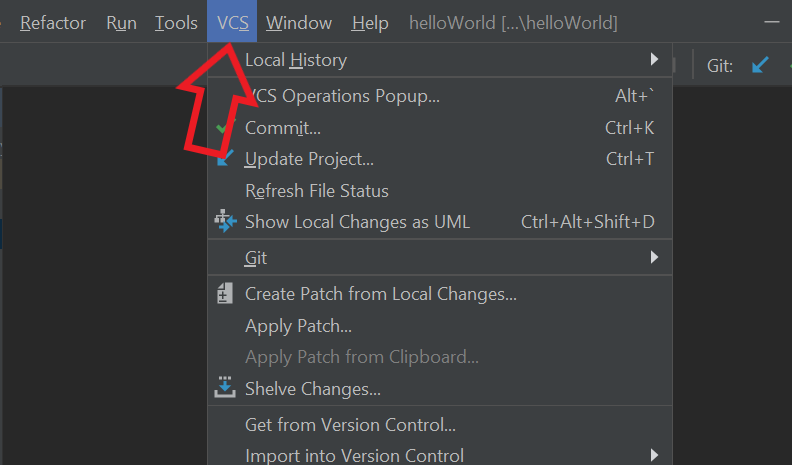
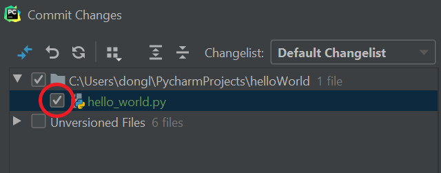
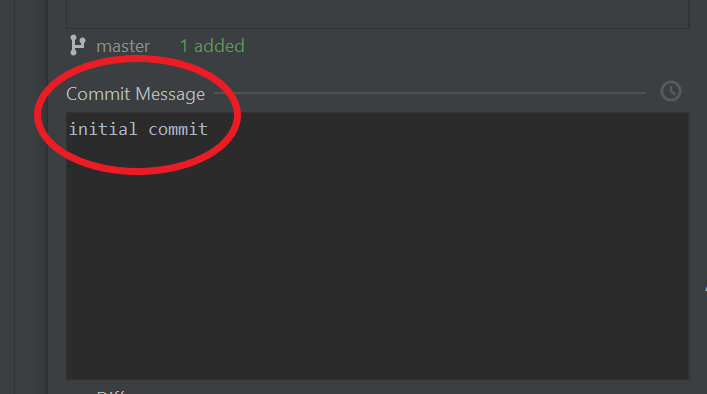
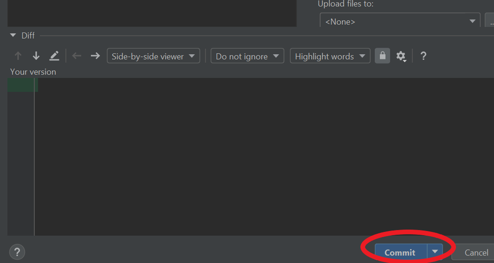

# Adding, Committing and Pushing your code to GitHub
{: .no_toc }	


Use PyCharm to add, commit and push your code to GitHub
{: .fs-6 .fw-300 }	
## Table of contents	
{: .no_toc .text-delta }	
1. TOC	
{:toc}	

***

Version control and sharing your code using Git and GitHub are two of the most sought after skills that employers look for. By following the steps, you will be able to keep track of different version of your code as you work on a project and share them as required.

___Note: A Git repository must be set up beforehand. See "Creating a Git Respository and Connecting to Github" to set up a git repository___ (connect to the other page")

***

## Adding Files
Before you can start creating different versions of your code by committing them, you first need to stage/add files to the repository, this will enable the file to be considered for the commit.

1. Open the file you want to add to Git repository
> 

___Note: all the files that have not been added yet will appear in red font___

2. Click ```VCS``` from menu bar at the top
> 

3. Click ```Git```
> 

4. Click ```Add``` to stage the files for commit
> 

- which is an equivalent of typing ```Ctrl``` + ```Alt``` + ```A``` on your keyboard

OR

Right click the file on the sidebar, click ```Git``` then ```Add```
> 

___Note: the file name will appear in green when you successfully add the file___


***

## Committing Files

1. Click ```VCS``` from menu bar at the top
> 

2. Click ```Commit``` (Or click __[CTRL]__ + __[K]__ on your keyboard)
> ![Click "Commit" (Or click __[CTRL]__ + __[K]__ on your keyboard)](../assets/images/task3-2-2.png)

3. Check the checkboxes for the files you would like to commit
> 

4. Write a commit message
> 

5. Click ```Commit```
> 

___Note: the file name will appear in white when you successfully add the file___

***

## Pushing to GitHub

1. Click ```VCS``` from menu bar at the top
> 

2. Click ```Git```
> 

3. Click ```Push...``` (or click __[CTRL]__ + __[Shift]__ + __[K]__ on your keyboard for shortcut)
> ![Click "Push..." (or click __[CTRL]__ + __[Shift]__ + __[K]__ on your keyboard for shortcut)](../assets/images/task3-3-3.png)

***

You have added, committed, and pushed your code to your GitHub cloud repository.
You can check whether the process was successful by logging into your GitHub account and checking your version history. 
