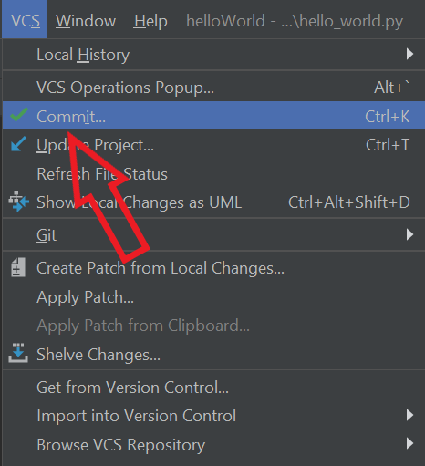
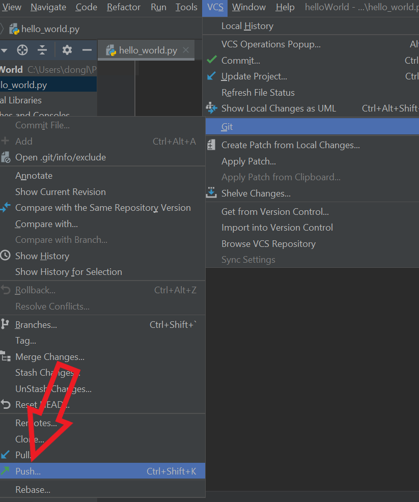

# Adding, Committing and Pushing your code to Github
{: .no_toc }	


Git is a version control system for keeping track of code changes. You can record the current version by adding and committing your code to your local Git repository. You can collaborate with other programmers with the use of GitHub. Push your Git repository to GitHub where you can share your code.
{: .fs-6 .fw-300 }	
## Table of contents	
{: .no_toc .text-delta }	
1. TOC	
{:toc}	

***

___Note: A Git repository must be set up beforehand. See "Creating a Git Respository and Connecting to Github" to set up a git repository___ (connect to the other page")

***

## Adding Files
Before you can start creating different versions of your code by committing them, you first need to stage/add files to the repository, this will enable the file to be considered for the commit.

1. Open the file you want to add to Git repository
> 

2. Click ```VCS``` from menu bar at the top
> 

3. Click ```Git```
> 

4. Click ```Add``` to stage the files for commit
> 

- which is an equivalent of typing ```Ctrl``` + ```Alt``` + ```A``` on your keyboard

OR

Right click the file on the sidebar, click ```Git``` then ```Add```
> 

***

## Committing Files

1. Click ```VCS``` from menu bar at the top
> 

2. Click ```Commit``` (Or click ```CTRL``` + ```K``` on your keyboard)
> 

3. Check the checkboxes for the files you would like to commit
> 

4. Write a commit message
> 

5. Click ```Commit```
> 

***

## Pushing to GitHub

1. Click ```VCS``` from menu bar at the top
> 

2. Click ```Git```
> 

3. Click ```Push...``` (or click ```CTRL``` + ```Shift``` + ```K``` on your keyboard for shortcut)
> 
